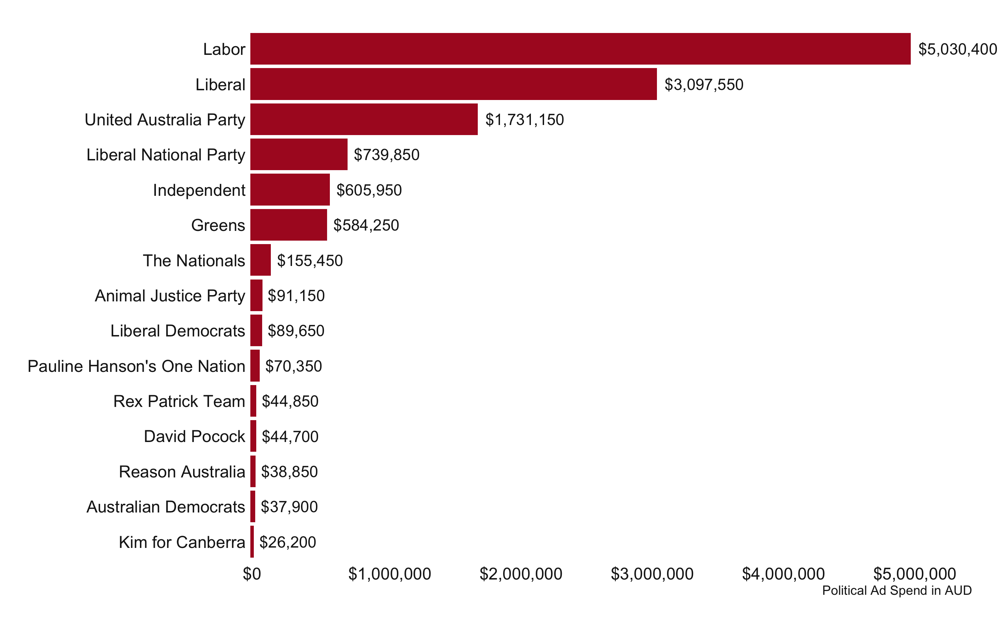
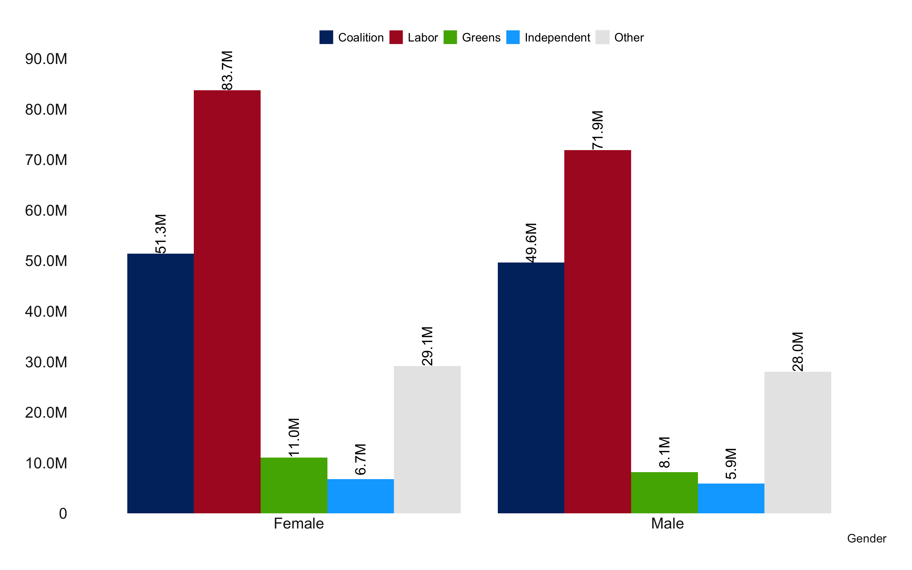

# Facebook Ads

**[Report](https://australiainstitute.org.au/report/political-advertising-on-social-media-platforms-during-the-2022-federal-election/)**

I analysed the expenditure on social media advertising by politicians and parties during the 2022 Australian Federal Election. I do this by 
  1. Querying the Meta Ad Library API to obtain metadata on 27,000+ political ads run on Facebook and Instagram using the RAdLibrary package (**[Code](fb_api.R)**)
  2. Merge this data with the Australian Electoral Commission dataset on parties and candidates contesting the 2022 election (**[Code](merging_cleaning.R)**)  
  3. Analyse ad expenditure by party, candidate and electorate (**[Code](ad_exp_visualisations)**)
  
The main findings are as follows:
  1. The Labor party lead across parties in terms of spending, followed by the Liberal Party
  
  2. The electorate of Kooyong saw the highest cumulative candidate expenditure 
  
  3. Labor and Greens engaged substantially more women audiences compared to the Coalition. 
  
